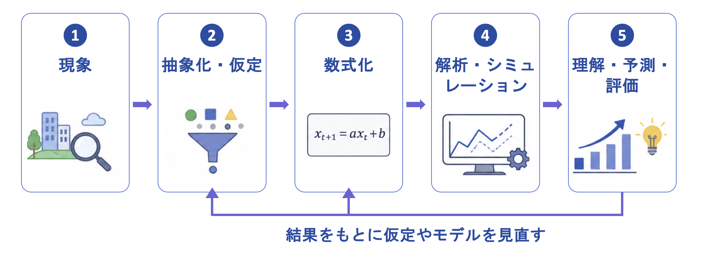

# 第3章 数理モデリングの学習とテーマの検討

本章では，プロジェクトテーマの決定に先立って行った準備活動について述べる．はじめに，本プロジェクトの中核となる数理モデリングの概要と一般的な手順を整理する．次に，輪講会を通じた基礎学習の目的と内容を報告し，最後に，テーマを決定するために行ったアイデア出しについて述べる．

## 3.1 数理モデリングとは

数理モデリングとは，現実に生じている現象や問題から重要な要素を抽出し，それらの関係を数式や規則などによって数学的に表現することで，現象の理解，予測および評価を行うための手法である．このとき，現実の現象や問題を数学的に表現したものを数理モデルという．

数理モデルを構築するための唯一の手順が定められているわけではないが，一般的には，現実の問題を明確にし，仮定や変数を設定して数学的に表現した後，得られた結果を分析・評価するという流れで行われる．本プロジェクトでは，数理モデリングの手順を次のように整理する．

1. 対象とする現象や問題を明確にする
2. 重要な要素を抽出し，必要な仮定を設定する
3. 要素間の関係を数式や規則などによって表現する
4. 構築した数理モデルを解析し，必要に応じてシミュレーションを行う
5. 得られた結果を解釈し，現実の現象やデータと比較する
6. 仮定やモデルの妥当性を評価し，必要に応じて修正する

はじめに，現実の現象を観察し，何が問題となっているのか，何を明らかにしたいのかを整理する．次に，現象に関係する要素の中から，対象とする問題において重要と考えられるものを選択する．現実のすべての要素を扱うことは困難であるため，問題の本質を失わない範囲で単純化し，必要な仮定を設定する．

その後，選択した要素を変数として定め，要素間の関係を数式や規則などによって表現する．構築した数理モデルは，数学的に解析するほか，コンピュータによる数値計算やシミュレーションを用いて，条件を変更した場合の結果を調べる．

最後に，得られた結果が現実の現象に対してどのような意味を持つかを解釈し，観察結果や実測データと比較する．結果と現実の状況に大きな差がある場合には，設定した仮定，使用したデータ，モデルに取り入れた要素などを見直す必要がある．このように，数理モデリングは一度モデルを構築して終了するものではなく，図3.1に示すように，結果の評価に基づいて前の段階へ戻り，モデルを修正する過程を繰り返すものである．

（文責　佐々木出）

## 3.2 輪講会による基礎学習

### 3.2.1 輪講会の目的

本プロジェクトの根幹には，「数理モデリングを用いて，函館市や未来大学に関わる人々にとって有益な成果物を作成する」という目標があり，数理モデルの構築はプロジェクトの中核的要素である．しかし，プロジェクト開始当初，メンバーの多くは数理モデルの構築経験がなく，モデル作成に必要な理論や技術に対する理解も十分ではなかった．また，数理モデルを構築する過程では数値計算法に関する知識が求められる場面も多く，たとえ最終的に使用しない手法であっても，手法の選択や判断を行うためには一定の知識が必要である．そこで，数理モデリングに必要となる基礎理論や数値計算法を学習するため，輪講会を実施することにした．

輪講会の目的は以下の2点である．1つ目は，プロジェクトメンバーが数理モデルの構築に必要な知識や経験を身につけ，数値計算法に関する基本的な理解を深めることである．2つ目は，輪講会で得た知識をもとに，プロジェクトテーマに沿った数理モデルを作成する際，必要な手法や知識を自ら判断し，適切に選択できるようになることである．

（文責　西島暖華）

### 3.2.2 使用した書籍と選定理由

本プロジェクトの輪講会では，森北出版の『Pythonによる数値計算法の基礎』[] と，ソシム株式会社の『データ分析のための数理モデル入門』[] を使用した．

『Pythonによる数値計算法の基礎』は，数値計算に必要な理論を平易に解説しつつ，Pythonによる実装方法にも丁寧に触れており，数理モデリングに必要な数値解法の学習に適していると判断した．書籍の内容には，ニュートン法やオイラー法，補間法，常微分方程式の数値解法など，プロジェクトで扱うテーマに直接関わる技術が多く含まれている．特に，演習問題が豊富であった点が選定の決め手となった．実際に手を動かしてモデルを構築し，数値的な近似や解法を体験できることにより，理論の理解を深めるとともに実践的なスキルの習得にもつながった．また，Pythonを使用する構成になっていたことも，本書を選んだ理由のひとつである．私たちのプロジェクトではモデルの実装や検証にPythonを用いる予定であり，学習と実務が直結する形でスムーズに接続できた．

『データ分析のための数理モデル入門』は，さまざまなモデリング手法の基礎を解説するだけでなく，それらをどのように選択し活用すればよいかについても丁寧に説明されており，モデリング手法の学習に適していると判断した．書籍の内容には，回帰分析や分類，クラスタリング，ベイズ推定，モデル選択など，データ分析に必要な基本的な手法が幅広く含まれている．特に，単に手法を解説するだけでなく，目的に応じたモデルの選択方法や適用場面についても説明されていた点が選定の決め手となった．数理モデリングでは，課題に適したモデルを選択し，結果を適切に評価することが重要であるため，本書を通して各手法の特徴や使い分けを理解することができた．また，図を交えながら丁寧に説明されていたため，各手法の特徴や違いを理解しやすく，効率的に学習を進めることができた．

このように，両書籍は輪講会の目的に合致しており，プロジェクト全体の基礎力の向上に大きく貢献した教材であった．

（文責　成田吏希）

### 3.2.3 輪講会で学習した内容

本プロジェクトの輪講会では，数理モデリングの基礎となる数値計算法や関連理論を体系的に学習した．以下に，各書籍で学習した内容を述べる．

#### 『Pythonによる数値計算法の基礎』

本教科書では，数値計算を用いて方程式や微分方程式を近似的に解くための手法について学んだ．解析的に解くことが困難な問題に対して，数値解法を用いることでコンピュータ上で解を求める方法を理解した．また，各手法には精度や計算量などの特徴があり，対象とする問題に応じて適切な手法を選択することの重要性を学んだ．

**非線形方程式の求解**：非線形方程式の解法として，はさみうち法と二分法という基礎的な数値計算手法を学んだ．課題として提示された「f(a) と f(b) が同符号の場合には適用できない」という制約を通して，数値計算手法には適用条件があり，それらを満たして初めて正しく解を求められることを理解した．また，実際のモデリングでは，対象となる関数の性質や初期値の設定によって計算結果が大きく左右されるため，手法を適切に選択することの重要性を学んだ．さらに，コードを実行することで，はさみうち法と二分法をPythonで実装する方法や，実装した際の動作について理解を深めることができた．

**常微分方程式の数値解法**：常微分方程式の数値解法として，テイラー法，オイラー法，修正オイラー法，ルンゲ・クッタ法について学んだ．これらは連続的な変化を離散的に近似する方法であり，特に物理現象や人流などの時間発展を表現するために重要な技術である．テイラー法は高次の微分を考慮することで精度の高い近似解を求める手法であり，オイラー法はある時点での傾きを利用して次の値を求めるため実装が容易である一方，刻み幅が大きい場合には精度が低下しやすいことを学んだ．また，修正オイラー法はオイラー法で生じる誤差を補正することで，より精度の高い近似解を求める手法であることを理解した．さらに，ルンゲ・クッタ法は区間内の複数の点における傾きを利用することで，オイラー法よりも高い精度で近似解を求めることができる手法であり，テイラー法のように高次の微分を直接求める必要がないことから，実際の数値計算で広く利用されていることを学んだ．Pythonでこれらの手法を実装したプログラムを確認することで，各数値解法がどのような手順で近似解を求めているのかを理解することができた．

**連立常微分方程式・高階常微分方程式**：連立常微分方程式は，複数の変数が互いに影響し合いながら変化する現象を表すための方程式であり，ルンゲ・クッタ法などの数値解法を用いて解くことができることを理解した．また，高階常微分方程式についても課題として取り組み，高階の方程式を一次の連立常微分方程式へ変換することで，同様の数値解法を適用できることを学んだ．これらの学習を通して，より複雑な微分方程式であっても，適切な形に変換することで数値的に解くことが可能になることを理解した．

#### 『データ分析のための数理モデル入門』

本教科書では，データを分析することの目的や，数理モデルを用いて現象を理解・予測するための考え方について学んだ．データ分析では，単にデータを処理するだけではなく，対象となる現象や目的に応じて適切なモデルを構築することが重要であることを理解した．その後，モデルの設計，パラメータの推定，モデルの評価という数理モデリングの一連の流れについて学習した．

まず，モデルを決めるための要素とモデルの設計方法について学んだ．数理モデルには，理解志向型モデリングと応用志向型モデリングという2つのアプローチがある．理解志向型モデリングは，現象の仕組みや原因を明らかにすることを目的としたモデルである．一方，応用志向型モデリングは，現実の問題を解決したり，将来を予測したりすることを目的としたモデルである．また，モデルを決定する際には，目的や利用できるデータを考慮し，適切な変数を選択することが重要であると理解した．特に，モデルの性質が変わらない範囲で変数を必要最小限にすることで，モデルの構造が分かりやすくなり，解析や解釈が容易になることを学んだ．

次に，パラメータを推定する方法について学んだ．数理モデルを構築するだけでは現実の現象を十分に表現することは難しく，実際のデータに適したパラメータを推定することが重要であると理解した．特に，予測値と実測値との差を評価し，その誤差ができるだけ小さくなるようにパラメータを決定する最小二乗法について学んだ．これにより，モデルの精度を高めるためには，適切なパラメータ推定が不可欠であることを理解した．

最後に，モデルを評価する方法について学んだ．モデルは構築するだけではなく，目的に応じた評価指標を用いて性能を評価し，必要に応じて改善することが重要であると理解した．また，「いいモデル」とは単に精度が高いモデルではなく，目的を達成するために役立つモデルであることを学んだ．これまで学んだモデルの設計やパラメータ推定と合わせて，数理モデリングは「モデルを作る・推定する・評価する」という一連の流れによって成り立っていることを理解することができた．

全体を通して，輪講会では理論の学習にとどまらず，Pythonでの実装を通じて数値計算法の理解を深め，知識の定着と応用力を高めることができた．また，数理モデルを構築する際には，対象とする現象や目的に応じて適切なモデルを選択し，必要なパラメータを推定した上で，モデルの評価・改善を行うことが重要であることを学んだ．

（文責　西島暖華）

## 3.3 アイデア出しとテーマの決定

本プロジェクトでは，どのようなテーマに取り組むかを決定した．テーマに関する話し合いは，プロジェクト学習活動時間の第2回から第6回にかけて行った．まず，プロジェクトメンバー9人がそれぞれ1つずつアイデアを考え，提案した．その結果，提案されたアイデアは大きく「バス・市電の混雑」，「店・施設のオペレーションの簡略化」，「熊の出没予想」，「災害時の最適な避難経路の提案」の4つの分野に分類された．次に，各分野について関連するキーワードやアイデアを整理し，それらのつながりを可視化するためにマインドマップを作成した．その後，マインドマップを基に「成果物の有用性」，「新規性」，「主観的な興味」などの観点から議論を行い，「バス・市電の混雑」と「店・施設のオペレーションの簡略化」の2つのアイデアに絞り込んだ．さらに，この2つのアイデアについて，上記の観点に加えて「データの入手可能性」や「数理モデリングとの相性」などの観点から比較・検討した．その結果，「バス・市電の混雑」に関するテーマに決定し，未来大学の学生にとって身近な交通手段であることを考慮して，対象をバスに絞ることとした．

（文責　成田吏希）
