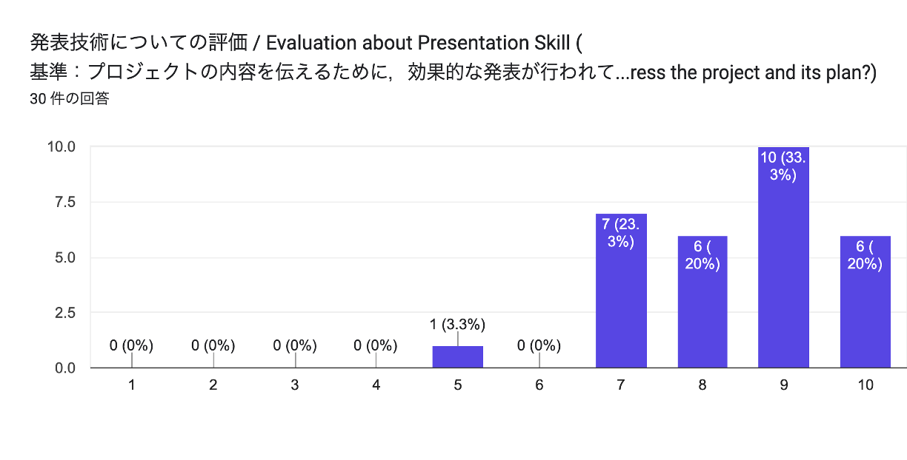
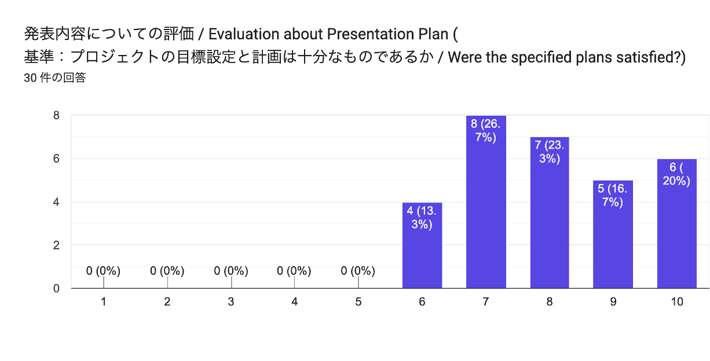

# 第4章 中間発表における成果と評価

本章では，中間発表に向けた準備と発表内容の概要を述べたうえで，聴講者および審査教員から得られた評価を整理し，その考察と今後の方針について述べる．

## 4.1 中間発表に向けた準備

中間発表に向けた準備段階において，本プロジェクトではまず「数理モデリングの対象とする現象の選定（テーマ決め）」の議論に多くの時間を割いた．複数の候補から対象を絞り込むにあたり，発表直前まで慎重に吟味を行った．テーマ決定後は限られた時間の中で迅速に成果を形にするため，詳細な数理モデルの数式化よりも，まずは現象の全体像を動的に表現するためのシミュレーターの実装を最優先で進め，発表資料を整えて本番に臨んだ．

（文責　石原達弥）

## 4.2 発表内容の概要

中間発表では，「亀田支所前～未来大学間における一部路線の快速バス化による混雑分散効果」をテーマとして，数理モデリングの進捗報告を行った．発表では，はじめに数理モデリングとは何かを説明したうえで，第1章で述べた背景と課題，および第3章で述べた快速化・2周運行という解決策の方針を紹介した．そのうえで，バス乗客の選択行動や停留所でのタイムロスを動的に捉えるため，シミュレーションによるアプローチを採用することを示した．

現時点の成果としては，実際のバスの運行状況や乗客の動きに関わるデータを処理し，混雑や遅延がどこで発生しているかを抽出・分析するための簡易的なプログラムを作成し，テーマ選定と対策の絞り込みの根拠を明確にした点までを報告した．

（文責　石原達弥）

## 4.3 発表に対する評価

中間発表において聴講者および審査教員から得られた評価について，定量的な評価結果と，記述式のフィードバック（全21件）をもとに整理する．

> **TODO**: 評価結果のグラフを作成して `figures/ch4_eval_technique.png` と `figures/ch4_eval_content.png` に置く．

### 4.3.1 発表技術に関する評価

発表技術に関する記述コメントを分類したところ，スライドのデザインや発表態度について多くの肯定的な評価を得た．具体的には以下の通りである．

良かった点：

- スライドの視覚的効果：「デザインが洗練されていて要点がまとまっている」「実際の動画やデモ（問題抽出のデータ処理）を用いており，視覚的に非常にわかりやすかった」との意見が多数を占めた．
- 発表の工夫と態度：「ハキハキとしていて聞き取りやすい声量・スピードだった」「スマートフォンをスライド切り替え用の遠隔リモコンとして活用し，前を向いてカンペを見ずに堂々と発表していた」という点が特に高く評価された．
- 構成の工夫：冒頭で「数理モデリングとは何か」を丁寧に説明したため，専門外の聴講者からも「その後の話がすんなり理解できた」という好意的なフィードバックを得た．

改善点・数理的課題への指摘：

- 数理モデリングとしての具体性：「やりたいことはよく分かるが，具体的にどういう数理的手法・アプローチ（数式やルール）を使うのかが見えにくい」という，モデリング班としての核心的な不足が指摘された．
- 評価指標の曖昧さ：快速化の効果を測るための具体的な指標がまだ決まっていない点，および快速化による移動時間の短縮効果を具体的に数値で示すべきという指摘があった．

### 4.3.2 発表内容に関する評価

発表内容に関しては，未来大学の学生にとって極めて身近な通学バスの混雑や積み残し，授業遅延を扱っていることから，非常に高い関心と共感を集めた．主な評価の点は以下の通りである．

- 課題設定への共感：普段バスを利用している聴講者からの共感が非常に強く，実際のデータを用いて混雑箇所などのボトルネックを特定したプロセスについて，中間までの成果として適切であるとの評価を得た点．
- 着眼点の新規性：混雑経路を快速化し，バスを効率よく2周運行させるというアイデアが面白いという点．
- 数理モデリングとしての具体性の不足：やりたいことは伝わるが，具体的にどういう数理的手法や数式，ルールを使うのかが見えにくいという指摘．
- 評価指標の曖昧さ：快速化の効果を測るための具体的な評価軸がまだ決まっていない点，および快速化による移動時間の短縮効果を具体的に数値で示すべきという指摘．

（文責　石原達弥）

## 4.4 評価の考察と今後の方針

4.3の評価を踏まえ，本プロジェクトの現状の分析と，最終報告に向けた今後の検討方針を策定した．

データ分析に基づくバスの快速化や2周運行というテーマが，聴講者に強く刺さることを確信できた点は大きな収穫である．また，コメントで寄せられたバス事業者のコストや総走行距離の増加という懸念については，本プロジェクトにおいて当初より想定している重要な制約条件であり，聴講者の関心の高さとも一致していることが確認できた．

一方で，数理モデリングプロジェクトとしての具体的な検証ロジックの肉付けが不足しているという指摘は厳粛に受け止める必要がある．今後は中間発表での指摘内容をグループ内で共有し，最終報告に向けて以下の要素を中心に具体的な方針を協議していく．

- 運行シナリオの検討とデータ実装の方向性：快速バスをどの時間帯に何本走らせるか，またどの停留所に停車させるかといった運行パターンの候補について，メンバー間でアイデアを出し合う．その上で，実際のバス運行データや乗客数データをどのようにプログラムへ反映させていくかを決定する．
- 評価指標の設定：快速化の効果を客観的に証明するため，平均乗車時間の短縮や積み残し人数の削減，遅延の分散度といった候補の中から，本プロジェクトにおいて何を主要な評価軸とするかを話し合って選定する．
- 現実的コストを考慮した運行設定の模索：バス事業者のコストや総走行距離の増減を制約条件としてどのように組み込むか，グループ内で基準を設定する．教員からのアドバイスにもあった通り，快速を作るという固定観念に縛られず，多様なアプローチをプログラム上で試行錯誤するための計画を練る．

スケジュールとしては，速やかにグループ内でのミーティングを設定し，これらの検討事項をもとに今後の具体的な役割分担と作業計画を確定させる．メンバー全員の合意のもとで複数シナリオの検証を進め，後期は数理モデリング班という看板にふさわしい，データとシミュレーションに基づいた説得力のある最終報告を目指す．

（文責　石原達弥）
